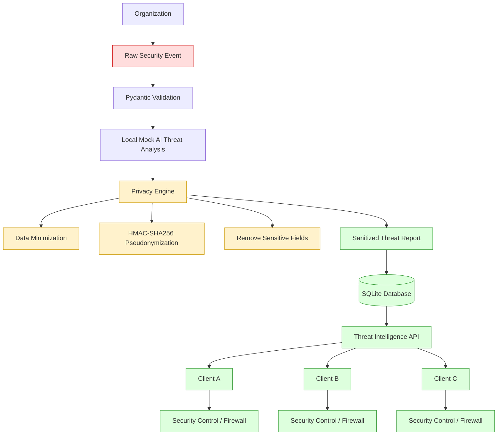

# Privacy-Preserving Threat Intelligence Network

A hackathon prototype demonstrating how an organization can share
actionable threat intelligence with other organizations **without**
ever exposing its identity, internal IP addresses, or other sensitive
internal information.

---

## 1. Problem Statement

Organizations detect security incidents (brute-force attempts, malware,
phishing, etc.) that would be valuable for *other* organizations to
know about — "someone is currently running a brute-force campaign
against SSH" is useful to everyone. But the raw incident data (which
company was hit, which internal IP was targeted, internal hostnames,
usernames, raw logs) is highly sensitive and cannot be shared as-is.
Sharing it would leak internal network topology and organizational
identity to every consumer of the feed.

## 2. Proposed Solution

A central service ingests raw incident data from a submitting
organization, runs local threat analysis, strips and pseudonymizes
every sensitive identifier, and stores/distributes **only** the
resulting sanitized threat-intelligence report. External clients
(other organizations' security tooling) subscribe to this sanitized
feed and can react to threats (e.g. enable MFA, block an attack
pattern) without ever learning who reported it or what their internal
network looks like.

## 3. Why Privacy Matters

If raw company names or internal IPs leaked into the shared feed:

- Competitors or attackers could learn which organizations are under
  attack, and when.
- Internal IP addressing schemes could be reconstructed, aiding
  reconnaissance against the reporting organization.
- Organizations would have a strong disincentive to participate,
  defeating the entire purpose of a shared threat-intelligence network.

Privacy is therefore not an add-on here — it is the mechanism that
makes the whole idea viable.

## 4. Architecture



Raw data never travels past the Privacy Engine:

```
RAW DATA
   X
   X  --> DATABASE            (never stored)
   X  --> EXTERNAL CLIENTS    (never returned)
   X  --> LOG FILES           (never logged)
```

## 5. Exact Data Flow

1. `POST /api/ingest-log` receives a raw security event.
2. `RawLog` (Pydantic) validates the payload.
3. `app/ai_engine.py` runs a local, deterministic mock AI analysis
   using only `attack_type` and `failed_attempts` — never
   `company_name` or `internal_ip`, and never over the network.
4. `app/privacy_engine.py` generates HMAC-SHA256 tokens for the
   sensitive identifiers and drops everything not needed downstream.
5. An `InternalSanitizedRecord` is built (tokens + threat intelligence
   only).
6. Only that sanitized record is stored in SQLite (`ThreatReport` ORM
   row — it has no column that could hold a raw sensitive value).
7. The submitting organization receives only a `SanitizedReport` (the
   ORM row is explicitly mapped to it — never serialized directly).
8. External clients call `GET /api/threat-feed` and receive the same
   `SanitizedReport` shape for every stored record.

## 6. Data Classification

**Sensitive data** (never stored, never returned, never logged):
`company_name`, `internal_ip`, username/hostname/internal-domain
fields (reserved for future extension), raw log messages, internal
infrastructure information, API keys, the privacy secret.

**Threat intelligence** (safe to store and distribute):
`threat_type`, `severity`, `impact_percentage`, `confidence`,
`attack_pattern`, `mitigation`, `target_service`, `indicator_type`,
`report_id`, `created_at`.

## 7. Why SHA-256 Alone Is Insufficient

`sha256(company_name)` is a **keyless** hash. Company names (and
internal IPs, which mostly live in a small private-range address
space) are low-entropy, guessable values. Anyone who obtains the
sanitized database — or even just a leaked token — could build a
wordlist of likely company names / IPs, hash each candidate with plain
SHA-256, and match it against the stored value in seconds. Plain
hashing therefore provides **no real protection** against
de-anonymization once an attacker has (or can guess) the candidate
value.

## 8. Why HMAC-SHA256 Is Used

`HMAC-SHA256(secret_key, normalized_value)` requires the secret key to
reproduce any candidate token. As long as `PRIVACY_SECRET_KEY` stays
on the server and is never leaked, an attacker with only the sanitized
database cannot run the same offline dictionary attack — they would
need the secret key as well. This is the standard cryptographic
technique for keyed pseudonymization, as opposed to unkeyed hashing.

Token format: `hmac_v<version>_<64 hex characters>` (the version
prefix exists so a future key rotation can be represented explicitly,
even though rotation itself is out of scope for this MVP).

## 9. Data Minimization

The system does not "hash and share everything." `company_name` and
`internal_ip` are pseudonymized into internal-only correlation tokens
(`organization_token`, `indicator_token`) that stay in the database for
potential internal auditing, but are **never** included in any API
response — external clients only need to know *what kind of attack*
is happening and *how to defend against it*, not *who* reported it.

## 10. Database Design

SQLite + SQLAlchemy 2.x ORM, one table: `threat_reports`
(`app/db_models.py`). It has **no column** named `company_name`,
`internal_ip`, `raw_log`, `username`, `hostname`, or `privacy_secret` —
this is enforced by the schema itself, not just by application logic.
Indexes exist on `created_at`, `severity`, and `threat_type` for the
feed and stats queries. Tables are created automatically on
application start-up (`init_db()`); no manual SQL is required.

## 11. API Endpoints

| Method | Path                | Auth        | Purpose                                   |
|--------|---------------------|-------------|--------------------------------------------|
| POST   | `/api/ingest-log`   | `X-API-Key` | Ingest a raw event, return sanitized report |
| GET    | `/api/threat-feed`  | `X-API-Key` | Retrieve sanitized reports (`limit`, `offset`) |
| GET    | `/api/health`       | none        | Liveness check                             |
| GET    | `/api/stats`        | none        | Safe aggregate counts by severity          |

`limit` on `/api/threat-feed`: min `1`, max `100`, default `20`.
No endpoint returns raw logs, organization names, or internal network
details — there is no `/raw-logs`, `/organizations`,
`/internal-network`, or `/company-details` endpoint.

## 12. Authentication

API-key authentication via the `X-API-Key` header, compared with
`secrets.compare_digest()` (constant-time comparison). Missing or
invalid keys return `401 Unauthorized`. Keys are never logged.

This is sufficient for a hackathon prototype, but a real production
system should consider OAuth2/JWT, mTLS, an enterprise identity
provider, key rotation, and a proper secret-management system (Vault,
AWS/GCP/Azure secret managers, etc.) instead of static `.env` keys.

## 13. Threat-Analysis Logic

`app/ai_engine.py` is a **deterministic mock engine**, not a real
model — see the note in Section 16 below. It classifies the incoming
`attack_type` string against eight canonical categories, then computes:

```
impact_percentage = min(100, base_impact + impact_modifier(failed_attempts))
confidence         = min(1.00, base_confidence + confidence_modifier(failed_attempts))
severity            = derived from the FINAL impact_percentage
```

Base impact values: Brute Force 60, SQL Injection 85, Malware 90,
Phishing 65, DDoS 95, Port Scanning 35, Credential Stuffing 75,
Ransomware 98.

`failed_attempts` modifier buckets (applied to both impact and, at a
smaller scale, confidence): `0-9` → `+0`, `10-49` → `+5`, `50-99` →
`+10`, `100-499` → `+15`, `500+` → `+20`.

Severity buckets (from final impact): `0-39` LOW, `40-69` MEDIUM,
`70-89` HIGH, `90-100` CRITICAL.

Worked example (Brute Force, 150 failed attempts):
`impact = min(100, 60+15) = 75` → `HIGH`;
`confidence = min(1.00, 0.80+0.15) = 0.95`.

## 14. Security Guarantees

For every request processed by this system:

- `company_name` and `internal_ip` exist only as local variables during
  request handling; they are read in exactly one place
  (`app.privacy_engine.sanitize_event`).
- Neither value is ever written to SQLite, returned in any API
  response, or written to the application log.
- The privacy secret and API keys are never returned by any endpoint,
  never logged, and never included in exception messages.
- Unhandled exceptions return a generic `{"detail": "Internal server
  error"}` — no stack trace, SQL, file path, or raw input is ever
  exposed to a client.

These guarantees are enforced by the test suite in `tests/`, and in
particular by `tests/test_security.py::test_central_privacy_claim_end_to_end`.

## 15. Security Assumptions

The prototype's privacy guarantee depends on:

- The `PRIVACY_SECRET_KEY` remaining confidential.
- The server infrastructure and its filesystem being reasonably secure.
- Correct configuration (a strong, unique secret; unique API keys per
  client).
- Authenticated access to both endpoints.
- Secure transport in production (see Limitations).
- Sound operational practices (log retention, access control, etc.).

## 16. Limitations

This prototype does **not** claim "100% privacy," "impossible to
deanonymize," "military-grade security," or "completely secure." It
prevents *intentional* exposure of the defined sensitive fields through
the database, API responses, the client feed, and normal application
logging — it is not a formal anonymity guarantee against a
sophisticated adversary with side-channel access, and it does not
protect against a compromised server or a leaked secret key.

The AI analysis layer (`app/ai_engine.py`) is a **deterministic mock
engine** used to demonstrate the architecture. A production deployment
could replace it with a validated ML/AI model.

For production use, consider adding: HTTPS/TLS termination, a real
secret manager or HSM/KMS, key rotation, OAuth2/JWT or mTLS, rate
limiting, a WAF, stronger audit logging, centralized monitoring,
database hardening/encryption at rest, STIX/TAXII interoperability
(see below), message queues / event streaming for higher throughput,
and enterprise identity management. None of these are required for
this MVP and are intentionally left out to keep the hackathon demo
simple and reliable.

**Future improvement — STIX/TAXII:** the architecture is intentionally
structured so a future version could map each `SanitizedReport` to a
STIX 2.x Indicator/Observed-Data object and distribute it via a TAXII
server, without changing the privacy engine. This is not implemented
in the MVP to avoid adding dependencies that could threaten the
reliability of the demo.

## 17. Installation

Requires Python 3.11+.

```bash
python -m venv .venv
source .venv/bin/activate        # Windows: .venv\Scripts\activate
pip install -r requirements.txt
```

## 18. Configuration

Copy `.env.example` to `.env` and fill in real values (a working `.env`
with randomly generated demo secrets is already included so the
project runs immediately out of the box — replace it before any real
use):

```
DATABASE_URL=sqlite:///./threat_intelligence.db
PRIVACY_SECRET_KEY=<a long random secret>
CLIENT_A_API_KEY=<random key>
CLIENT_B_API_KEY=<random key>
CLIENT_C_API_KEY=<random key>
PRIVACY_KEY_VERSION=1
```

`.env` is git-ignored; never commit real secrets.

## 19. Running the Server

```bash
uvicorn app.main:app --reload
```

or:

```bash
python run.py
```

The server starts at `http://127.0.0.1:8000`. Interactive API docs are
available at `http://127.0.0.1:8000/docs`.

## 20. Running the Client Simulation

With the server running in one terminal, run in a second terminal:

```bash
python simulate_clients.py
```

This ingests one sample event as Client A, prints only the sanitized
response (explicitly showing that the company name and internal IP are
absent), then has Clients A, B, and C each retrieve the threat feed and
print a **simulated** firewall recommendation (no real OS firewall or
network device is touched).

## 21. Running Tests

```bash
pytest -q
```

35 tests across `tests/test_privacy.py`, `tests/test_api.py`, and
`tests/test_security.py` cover Pydantic validation, HMAC determinism
and key-sensitivity, data minimization, authentication, error handling,
and the end-to-end privacy claim.

## 22. Example API Request

```bash
curl -X POST http://127.0.0.1:8000/api/ingest-log \
  -H "Content-Type: application/json" \
  -H "X-API-Key: <CLIENT_A_API_KEY>" \
  -d '{
        "company_name": "Alpha Cyber Systems",
        "internal_ip": "10.10.20.25",
        "attack_type": "Brute Force",
        "failed_attempts": 150,
        "target_service": "SSH",
        "timestamp": "2026-09-25T10:30:00+05:30"
      }'
```

```bash
curl http://127.0.0.1:8000/api/threat-feed?limit=10 \
  -H "X-API-Key: <CLIENT_B_API_KEY>"
```

## 23. Example Sanitized Response

```json
{
    "report_id": "9bd7c1e2-4b3a-4e2a-9c3a-1a2b3c4d5e6f",
    "created_at": "2026-09-25T10:30:02.123456+00:00",
    "threat_type": "Brute Force",
    "severity": "HIGH",
    "impact_percentage": 75,
    "confidence": 0.95,
    "attack_pattern": "Repeated authentication failures detected",
    "mitigation": "Enable MFA, apply rate limiting, and temporarily block repeated failed authentication attempts",
    "indicator_type": "INTERNAL_NETWORK_EVENT",
    "target_service": "SSH"
}
```

This response does **not**, and never will, contain `"Alpha Cyber
Systems"` or `"10.10.20.25"`.

## 24. Future Production Improvements

- Replace the mock AI engine with a validated ML/AI model.
- Key rotation using the existing `hmac_v<version>_` token format.
- Move secrets into a dedicated secret manager / HSM / KMS.
- OAuth2/JWT or mTLS instead of static API keys.
- Rate limiting and a WAF in front of the API.
- STIX/TAXII interoperability for the sanitized feed.
- Message queue / event-streaming ingestion for higher throughput.
- Centralized, structured audit logging and monitoring.
- Database hardening and encryption at rest.

---

## Project Structure

```
privacy_preserving_threat_network/
├── app/
│   ├── __init__.py
│   ├── main.py            # FastAPI app, routes, logging, error handling
│   ├── config.py          # Environment-based configuration (no hardcoded secrets)
│   ├── database.py        # SQLAlchemy engine/session setup
│   ├── db_models.py       # ThreatReport ORM model (sanitized fields only)
│   ├── schemas.py         # RawLog, ThreatAnalysis, InternalSanitizedRecord, SanitizedReport
│   ├── privacy_engine.py  # HMAC-SHA256 pseudonymization, data minimization
│   ├── ai_engine.py       # Deterministic mock AI threat analysis
│   ├── auth.py            # API-key authentication
│   └── security.py        # Security headers middleware
├── tests/
│   ├── __init__.py
│   ├── conftest.py        # Isolated test DB/config fixtures
│   ├── test_privacy.py
│   ├── test_api.py
│   └── test_security.py
├── simulate_clients.py    # End-to-end demo script
├── run.py                 # `python run.py` convenience entry point
├── requirements.txt
├── .env.example
├── .env                   # Working demo secrets (git-ignored, replace for real use)
├── .gitignore
└── README.md
```

## Deploy a Free Render Demo

The repository includes a `render.yaml` Blueprint for a free Render web
service. To deploy it, sign in to Render, create a new Blueprint, connect
this GitHub repository on the `main` branch, and provide
`BOOTSTRAP_ADMIN_EMAIL` and `BOOTSTRAP_ADMIN_PASSWORD` when prompted.
Render generates the other required secrets and assigns the service a
stable `onrender.com` URL.

This demo uses SQLite on Render's temporary filesystem. The URL remains
the same, but the free service can sleep after inactivity and its database
can be erased on restart or redeploy. Use persistent database hosting for
data that must survive those events.
